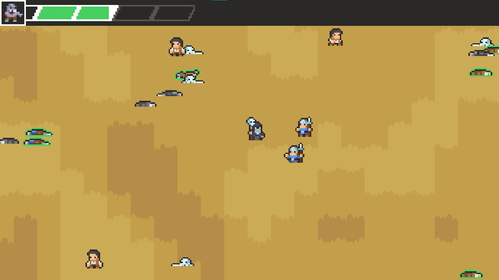
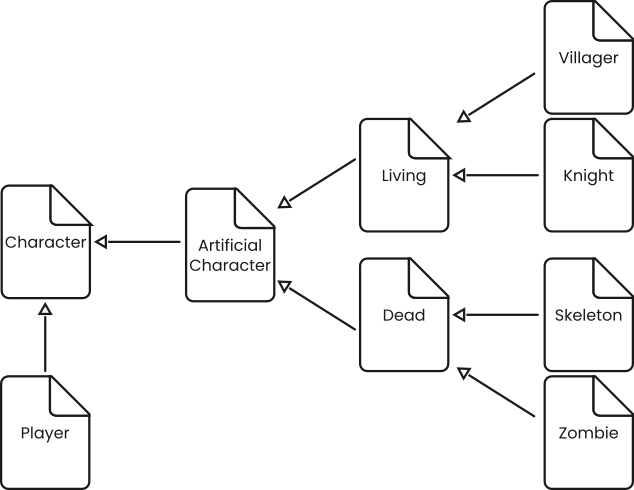
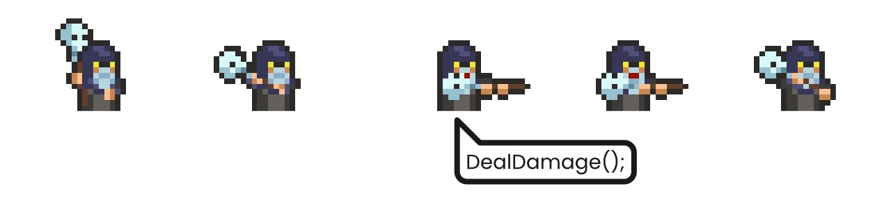
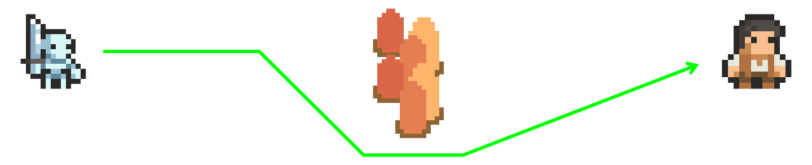
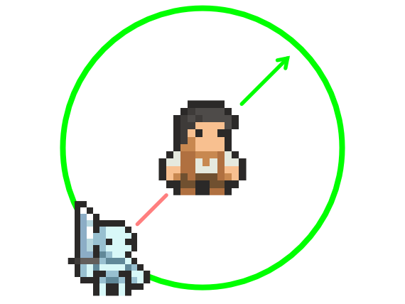

# Necromancy Game Mechanic

I have always liked the idea of Necromancy as a game mechanic. Although a lot of games have systems to kill other beings, being able to have those either reanimated against or for you has always been an interesting idea to me.

## What makes this idea unique?

I have played a few games with what I would consider to be pretty disappointing necromancy systems lacking depth. With the ability amounting to being able to summon creatures out of thin air. Although this works fine for a lot of games, I prefer the idea of being somehow tied to the creatures that have already been killed, reanimating them to do your bidding. On top of that, Necromancers usually play the role of enemies in game, but I think that they could be fun to play from a gameplay perspective.

## Mechanic breakdown

My Necromancy mechanic would require several different systems to all work together.

The first piece I made was the player. The player should have the ability to move, to attack, to summon enemies, and to die as a loss condition for the game. The player also should have access to some sort of resource that is used to revive the undead.

Next I made the undead. The undead need the ability to move, to attack the living, and to die.

After that I made the living. The living need the ability to move, to attack the undead, and to die. They also need to be available to the player once dead to be revived as an undead.

<!-- Gameplay image here -->

## Inheritance

After making a unique script for all of the different characters (player, undead, living) in my game, I realized that they all end up sharing some core mechanics. After that realization I started working on using inheritance in my scripts.

Using inheritance means that I can write some code in one script, and have that code be usable from as many different scripts as I want. This proves useful because you can refer to a child script by the name of its parent script while trying to access code contained in the parent script. This generalization helps for example when all the game characters need to be able to take damage. I can call the same method from the same script for each of the characters even if they are using different scripts as long as they all inherit from the same master script.

The way I used inheritance in my game is multi-generational, which means a script that inherits from a script that inherits from a script and so on until we reach the master script.

My master script is called “Character” and is the least complex script in this chain because the two scripts that derive from it have the least in common.

From “Character” I derived two scripts: The “Player” script and the “ArtificialCharacter” script. The “Player” script contains all the player logic and is the end of the chain down its branch. The “ArtificialCharacter” Script contains all of the AI path-finding logic for the living and undead characters as well as the logic for targeting and attacking others.

From “ArtificialCharacter” I derived two scripts: The “Living” script and the “Undead” script. The “Living” script contains the logic for targeting specifically the undead and the player and dropping the summoning resource, while the “Undead” script contains the logic for targeting specifically the living as well as some control the player has over where they go when out of combat.

_Above is a graph illustrating how I use inheratence in my project._

## Character

The “Character” script contains code for managing health. There is a health float, as well as a boolean to tell whether or not the character is dead. There is a method for taking damage, this method removes an amount of health from the current total. While the amount is subtracted the character flashes white to show that it is taking damage. If health reaches zero a death method is triggered which plays a death animation and sets the dead boolean to true.

### Player

The “Player” script has a few variables for how the attached object will interact with the world. These variables are for controlling the speed of the player, how much damage the player deals, how far the player can reach when attacking, and how far the player can reach when reviving dead enemies.

The script also has a reference to a UI element that displays how much health the player has as well as helps to select what undead creature the player would like to summon. There's also an array of all of the undead creatures so that they can be instantiated as copies into the world when the player wants.

In the update method of the script, I make sure that the player is not currently dead. If the player is not dead I flip the player’s sprite to face the current point of interest on the X axis, then I run some code to check for input for reviving the undead enemies as well as attacking.

In the fixed update method I do the same death check as in the update. If the player is not dead they are allowed to move based on player input. This bit of code is in the fixed update method because I am using a rigidbody for movement. The rigidbody is a physics component and acts in a jittery and unpredictable way when in the regular update method. The fixed update is specifically for physics updates and so leads the movement to work smoothly.

The movement code consists of getting a normalized vector2 from the keyboard input. This vector2 is then multiplied by the speed variable and then the player's velocity is set to the resulting vector.

For the sprite flipping, I first get the mouse position in world coordinates. Then I check if there is a living character within attack range. If there is, I change the scale of the player on the X axis to flip it based on if the living character is in front or behind the player. If there is no living character within attack range, the X axis scale is set based on the mouse's position.

For triggering the attack, I first find the nearest living character within the attack range. This is done by doing a circle cast around the player. If there are any living characters within the circle I iterate through them to find which one is closest to the player. If there is a closest living character, and the left mouse button is clicked I trigger an attack animation. The animation triggers a method from the script on the impact frame. The “DealDamage” method triggers the “TakeDamage” method in the target's “Character” script while passing attack damage variable as the amount to be subtracted.

<!--Attack diagram-->
*Above is an ilustration of how the animation triggering system works.*

The reviving trigger works in a very similar way to the attack trigger. I first find the nearest dead character. This is done in the same way as finding the living ones, but with an extra check of the death boolean. Then I use the player’s health as a resource to revive the dead. Anywhere from one to four health can be drained, with the player having a maximum of five health. Then if the player has the requisite amount of health, an animation is played that triggers a summon method. This method is a coroutine that waits a certain amount of seconds to instantiate the desired undead character, and stop triggering the animation.

While the player is in both the summon and the attack animation they are unable to move. I added this as a small risk the player has to take when they want to take an action, with the summon animation being the riskier of the two because it takes a couple of seconds.

### Artificial Character

The “ArtificialCharacter” script has a few basic variables to define how it will interact with the world, those being a movement speed variable, an attack speed variable, an attack damage variable and an attack range variable. Along with those, it has some variables to define how it’s pathfinding works, those being a stopping distance, a vision radius, a refresh frequency for updating the path, and a variable to define how far apart the pathfinding waypoints should be.

The most important piece of code is the “UpdatePath” method which I have running every half second. For this project I am leveraging a prebuilt solution for an A* pathfinding system from arongranberg.com. The update path method simply tells the A* solution the position of the current object and the position of its target.

Then I actually move the object by calculating the direction towards the next waypoint in the path, and adding a force to a rigidbody in that direction multiplied by a speed value. This is all done in the fixed update method for the same reasons as the player movement was.

<!--Pathfinding visual-->
*Above is a visualisation of the pathfinding.*

The target of the artificial character pathfinding is decided based on when some conditions are met. If there is one or more enemies (living for undead and vice versa) within the vision radius of an artificial character, it will find the closest one the same way the player does. If the artificial character reaches within the attack range of its enemy, it will begin an attack animation which functions in the same way the player’s does. If there is no closest enemy the artificial character will stand still.

#### Living

The “Living” script inherits all of the previously defined behaviors in the “ArtificialCharacter” script. On top of that, upon the death of a living character, it will drop some health refill. The amount is defined by an integer variable at the top of the script. Additionally I have an extra boolean to tell whether or not the corpse of the character has been revived or not, because I only wanted each corpse to be revived once.

#### Undead

The “Undead” script has some extra code for pathfinding target selection. Instead of standing still while there are no enemies in range, the undead character will have it’s pathfinding target set to the worldspace position of the mouse, unless the player presses the spacebar in which case the undead character will have it’s pathfinding target set to the position of the player character.

#### Scared

The “Scared” script derives from the “Living” script. The idea behind a scared character is that it is a character that can not attack. So when faced with an enemy within its vision radius, instead of walking towards that enemy, it walks in the opposite direction.

<!--scared character diagram -->
*Above is an ilustration of the logic behind the scared character.*

## Final Product

With all of the logic for those characters in place, I can now put the player into a game world along with some living characters.

I find the resulting gameplay loop both engaging and challenging. The player must manage their health in order to stay alive and to revive dead enemies to fight for them.

I have the game balanced in such a way that the player is weak, and only stands a chance against scared enemies who can not fight back. This helps to deepen the gameplay as you really need to revive some of the higher cost undead characters in order to stand a chance at survival.

Even if you manage to get a strong undead character, they can still perish and force you to have to think on your feet in your current situation. A little bit of bad luck and poor planning could send you back to the state you were in when you first started the game.

## Additional Info

A short playable demo of the game is available on itch.io. Further instructions can be found on the page.

The source code is viewable on Github, feel free too check it out.





